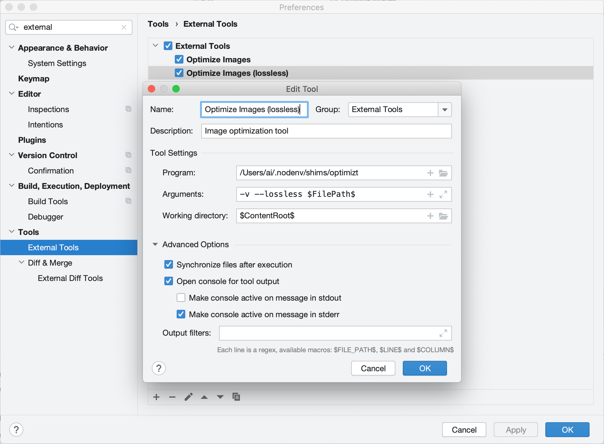
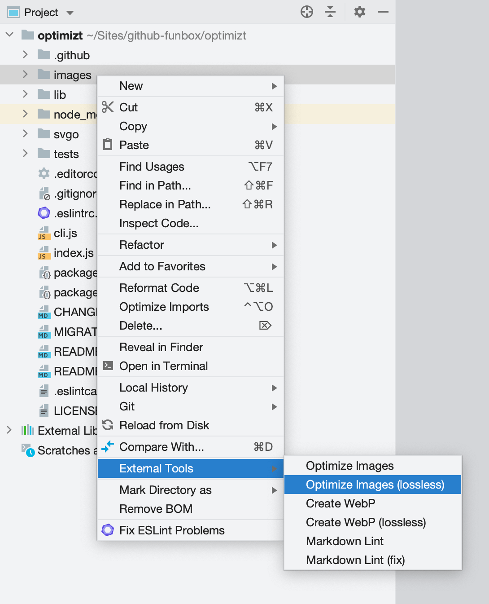
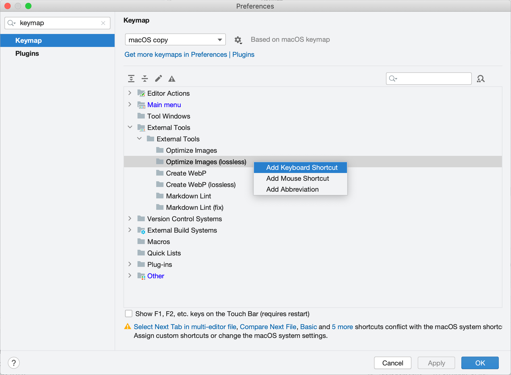

# JetBrains: Integrating Optimizt with “External Tool”

## Add an “External Tool”

Open _Preferences → Tools → External Tools_ and add a new tool with the following settings:

- Program: the path to the executable (usually just `optimizt`)
- Arguments: any needed options, but don't forget to use `$FilePath$` to pass the path of the selected file or directory to Optimizt.
- Working Directory: `$ContentRoot$`
- Synchronize files after execution: ✔️ (Checked)

The rest of the settings are up to you. For example:

As shown in the screenshot above, you can add multiple “external tools” with different settings.

## How to use

Right-click on a file or directory and run the necessary tool:

## Keyboard Shortcuts

You can add shortcuts for specific tools in _Preferences → Keymap → External Tools_:

