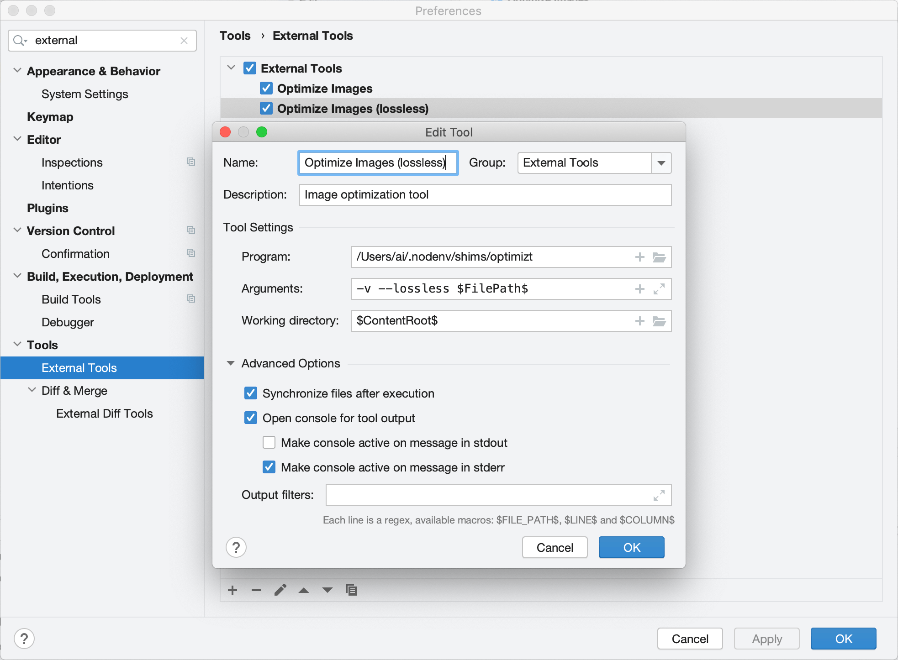

# JetBrains: интеграция Optimizt с помощью «External Tool»

## Добавьте «External Tool»

Откройте _Preferences → Tools → External Tools_ и добавьте новый инструмент со следующими настройками:

- Program: путь до исполняемого файла (обычно просто `optimizt`)
- Arguments: необходимые вам, но не забудьте использовать `$FilePath$` чтобы передать Оптимизту путь до выбранной директории или файла
- Working Directory: `$ContentRoot$`
- Synchronize files after execution: ✔️

Остальные настройки на ваше усмотрение. Например:

Как видно на скриншоте выше, вы можете добавить несколько «внешних инструментов» с разными настройками.

## Как использовать

Вызовите контекстное меню на файле или директории и запустите необходимое:

## Горячие клавиши

Добавить горячие клавиши для конкретного инструмента можно в _Preferences → Keymap → External Tools_:

