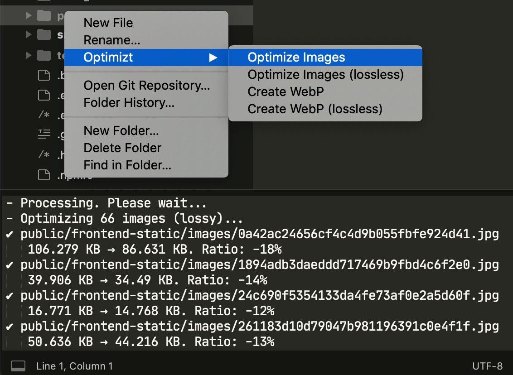

# Sublime Text 3: Integrating Optimizt with a Plugin

User Settings Paths:

- macOS: `~/Library/Application Support/Sublime Text 3/Packages/User`
- Linux: `~/.config/sublime-text-3/Packages/User`
- Windows: `%APPDATA%\Sublime Text 3\Packages\User`

## Add the Plugin

In the settings directory, create a file named `optimizt.py` with the following content:

```python
import os
import sublime
import sublime_plugin

optimizt = "~/.nodenv/shims/optimizt"

class OptimiztCommand(sublime_plugin.WindowCommand):
  def run(self, paths=[], options=""):
    if len(paths) < 1:
      return

    safe_paths = ["\"" + i + "\"" for i in paths]
    shell_cmd = optimizt + " " + options + " " + " ".join(safe_paths)
    cwd = os.path.dirname(paths[0])

    self.window.run_command("exec", {
      "shell_cmd": shell_cmd,
      "working_dir": cwd
    })
```

In the variable `optimizt`, specify the path to the executable, which you can find by running the command `command -v optimizt` (on *nix) or `where optimizt` (on Windows).

## Integrate the Plugin into the Sidebar Context Menu

In the settings directory, create a file named `Side Bar.sublime-menu` with the following content:

```json
[
    {
        "caption": "Optimizt",
        "children": [
          {
              "caption": "Optimize Images",
              "command": "optimizt",
              "args": {
                "paths": [],
                "options": "--verbose"
              }
          },
          {
              "caption": "Optimize Images (lossless)",
              "command": "optimizt",
              "args": {
                "paths": [],
                "options": "--lossless --verbose"
              }
          },
          {
              "caption": "Create WebP",
              "command": "optimizt",
              "args": {
                "paths": [],
                "options": "--webp --verbose"
              }
          },
          {
              "caption": "Create WebP (lossless)",
              "command": "optimizt",
              "args": {
                "paths": [],
                "options": "--webp --lossless --verbose"
              }
          }
        ]
    }
]
```

## How to Use

Right-click on a file or directory to open the context menu and run the desired action:


